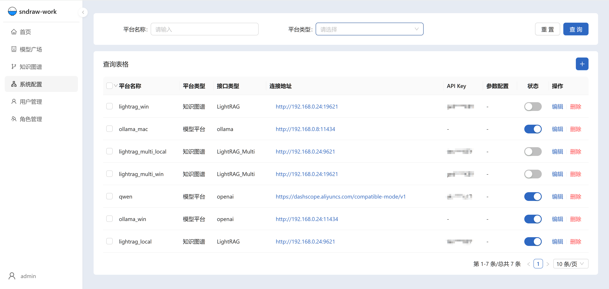
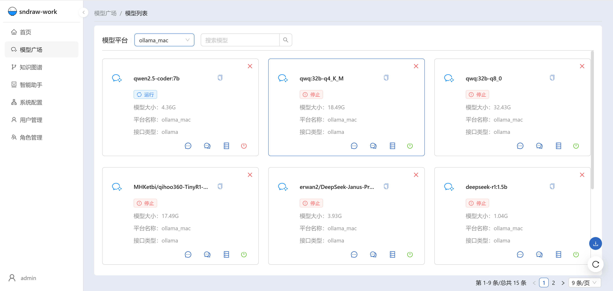
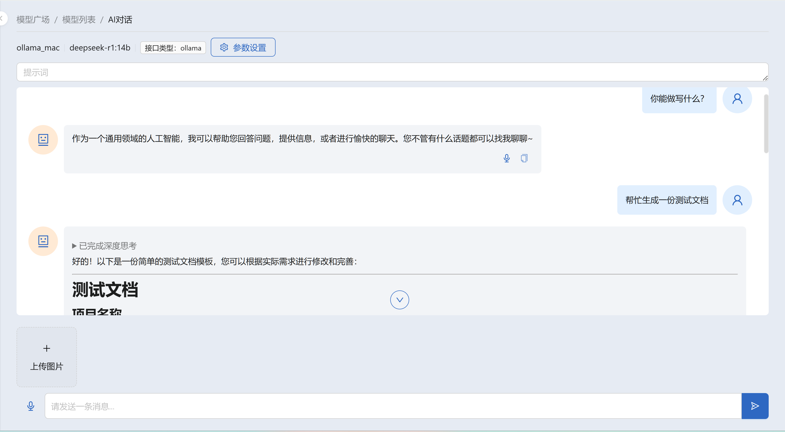
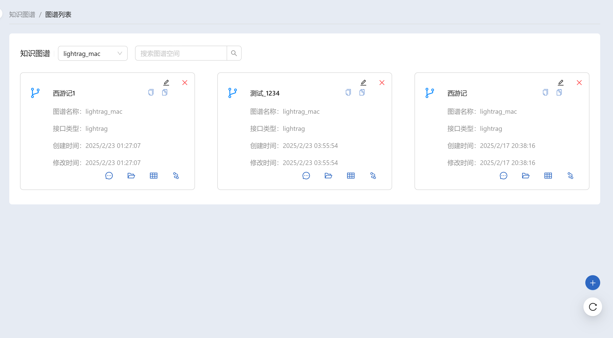
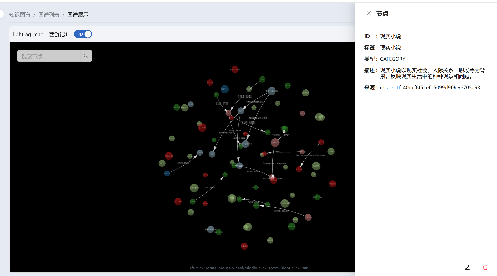
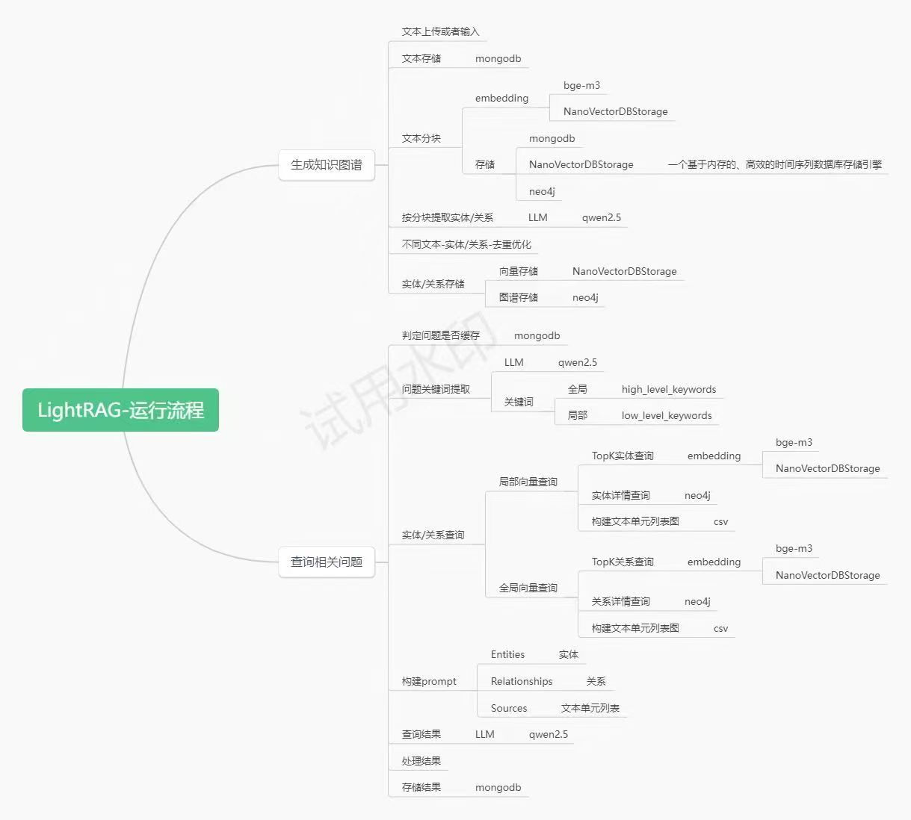

# sndraw-work
> AI模型与知识图谱管理平台
## 项目介绍
> 该项目是一个AI模型与知识图谱管理平台，旨在提供一个集中的地方来管理和使用各种机器学习和深度学习模型。它还支持构建和管理知识图谱，以便更好地理解和利用数据。

## 功能介绍
- ### 模型部署（多平台模型管理、模型问答）
  - [ollama](https://github.com/ollama/ollama)
  - [千问百炼](https://bailian.console.aliyun.com/)
  - [openai](https://github.com/openai/openai-python)

- ### 知识图谱（多知识图谱管理、2D/3D图谱展示、图谱问答）
  - [LightRAG](https://github.com/HKUDS/LightRAG)
  - [LightRAG_Multi(多图谱空间版本)](https://github.com/sndraw/LightRAG-Multi)

- ### 用户管理
  - 用户注册和登录管理
  - 权限控制和角色管理


## 目录结构
```text
- 根目录/
  - docker-deploy/ 
  - work-api/
  - work-web/
  - README.md
```
## 部署文档
- [/work-api/README.md](./work-api/README.md)
- [/work-web/README.md](./work-web/README.md)

## 使用指南
### 知识图谱添加步骤
> 1. 登录系统
> 2. 进入【系统配置】页面，点击“添加平台”按钮，填写并保存相关信息
> 3. 进入【知识图谱】页面，点击“添加图谱空间”按钮，填写并保存相关信息
> 4. 在图谱空间中上传文档，进行知识提取和图谱构建
> 5. 完成后，系统会自动生成图谱，用户可以查看和管理生成的图谱，并进行相关问答

### 系统配置示例
#### 模型平台-接口类型
> 1. ollama：http://127.0.0.1:11434
> 2. openai：https://dashscope.aliyuncs.com/compatible-mode/v1

#### 知识图谱-接口类型
> 1. LightRAG：http://127.0.0.1:19621
> 2. LightRAG_Multi：http://127.0.0.1:19621


## 截图展示
### 系统配置
  
### 模型管理
 
### 模型对话
  
### 图谱空间
  
### 图谱编辑
  
### 图谱展示



## 相关文档
### LightRAG-运行流程
  
